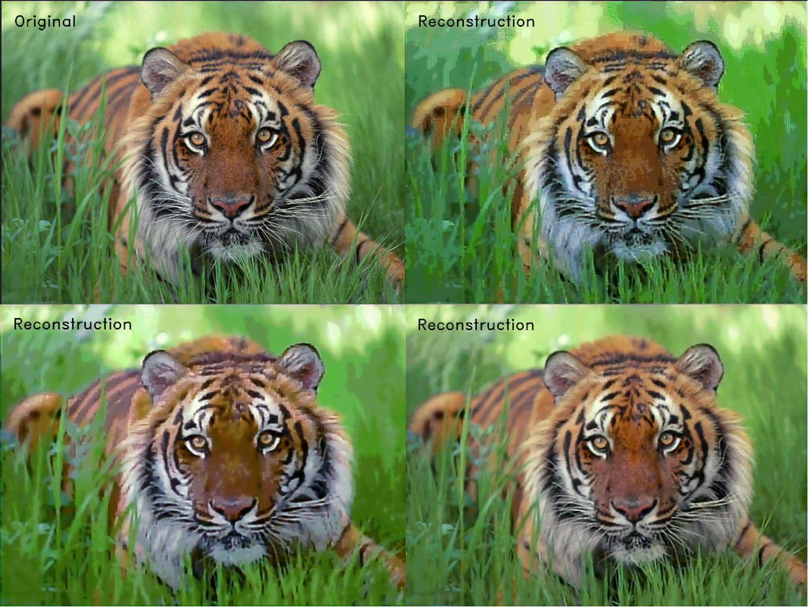
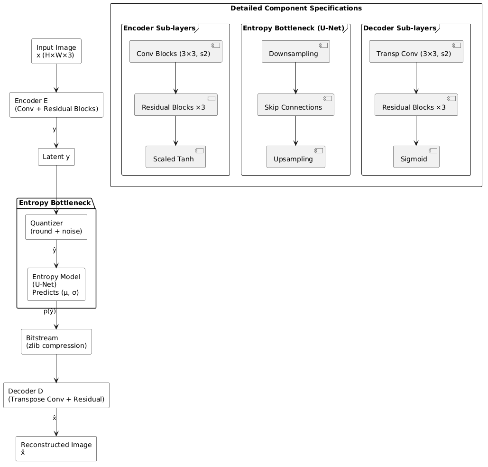
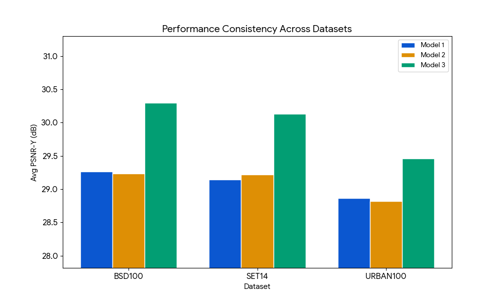
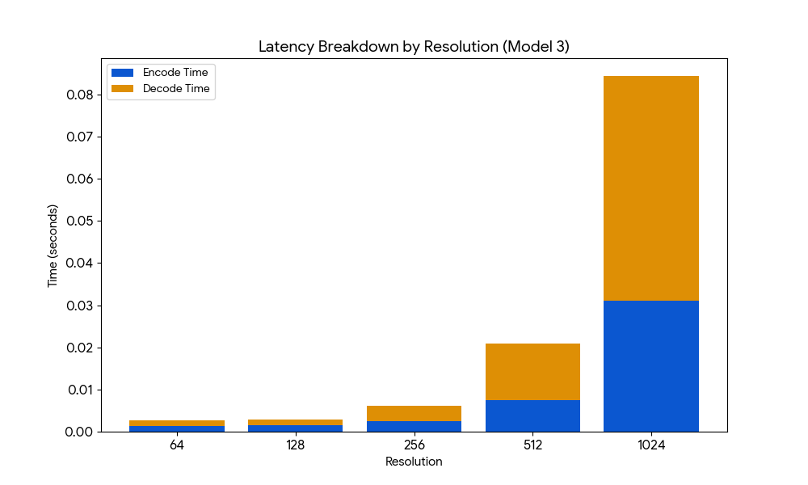
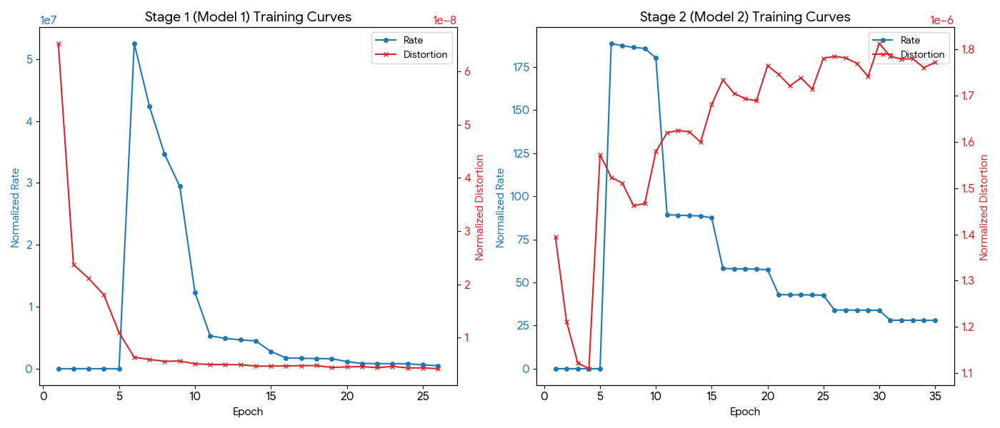

# Chrominance-Aware Progressive Rate-Distortion Optimization for Learned Image Compression

## Introduction
This project implements a fully learned image compression pipeline trained end-to-end under a rate-distortion objective. Unlike traditional codecs (JPEG, WebP, PNG) which rely on hand-crafted transforms, this system jointly trains an encoder, a probabilistic entropy model, and a decoder to learn compact, data-driven latent representations.

The key novelty is a progressive training strategy that produces three compression operating points from a single architecture, without independent retraining at each point, alongside a chrominance curriculum that progressively reallocates distortion loss capacity from luminance to colour fidelity across training stages.


*Sample visualization of compression after decoding on a 1600x1200 image

```
Top-Row: Original Image(left), High Compression(right)
Bottom Row: Medium Compression(left), Low Compression (Right)
```

#### High, Medium and Low compression throughout this README mean compression from training stage-1, training stage-2 and training stage-3


---

## Architecture


- Encoder — Three convolutional stages (32 → 64 → 128 channels) with LeakyReLU and max-pooling, producing a latent bounded by `tanh × 10`.

- Entropy Model — U-Net with 3-stage downsampling (128 → 256 → 512 → 1024 bottleneck), predicting per-symbol Gaussian parameters (`μ`, `log σ`). Used only during training as a differentiable bitrate surrogate; at inference, zlib handles compression directly.

- Decoder — Mirrors the encoder with transposed convolutions (128 → 64 → 32 channels), projecting back to 3-channel YCbCr output.

---

## Key Contributions

### 1. Progressive Rate-Distortion Training

A single model architecture is fine-tuned across three stages, each initialized from the previous stage's checkpoint. Rather than retraining three models from scratch, only the rate-distortion balance (`λ`, `β`) is shifted between stages via annealed loss weightings.

This eliminates training instability and Stage 2 begins with substantially lower entropy values than Stage 1 at equivalent distortion levels, confirming the efficiency of inherited latent representations.

### 2. Chrominance Curriculum

The distortion loss operates on channel-weighted MSE in YCbCr space:

```D = wY · MSE(ŷY, xY) + wCb · MSE(ŷCb, xCb) + wCr · MSE(ŷCr, xCr)```

Channel weights shift progressively across stages, mirroring human perceptual sensitivity:

| Stage   |  wY | wCb | wCr | Focus                   |
|---------|-----|-----|-----|-------------------------|
| Stage-1 | 0.8 | 0.1 | 0.1 | Luminance structure     |
| Stage-2 | 0.6 | 0.2 | 0.2 | Chrominance Enhancement |
| Stage-3 | 0.4 | 0.3 | 0.3 | Colour fidelity         |

### 3. Inference pipeline combines learned encoder with zlib compression, achieving sub-35ms latency on GTX 1650 without architectural changes.

---

## Results

### Compression Performance (BSD100 / Set14 / Urban100)

| Model                  | Compression Ratio | PSNR - BSD100 | PSNR - Set14 | PSNR - Urban100 |
|------------------------|-------------------|---------------|--------------|-----------------|
| Stage 1 (Aggressive)   | ~32×              | 30.51 dB      | 30.01 dB     | 29.89 dB        |
| Stage 2 (Moderate)     | ~17×              | 30.50 dB      | 30.38 dB     | 30.30 dB        |
| Stage 3 (Conservative) | ~3×               | 32.78 dB      | 32.07 dB     | 31.79 dB        |



### Comparison with Traditional Codecs (BSD100)
| Method         | PSNR (dB) | Compression Ratio |
|----------------|-----------|-------------------|
| PNG (lossless) | ∞         | 1.57×             |
| JPEG Q=90      | 41.39     | 8.53×             |
| JPEG Q=75      | 38.23     | 14.87×            |
| JPEG Q=50      | 36.63     | 22.01×            |
| Ours (Low)     | 33.21     | 10.01×            |
| Ours (Medium)  | 30.63     | 58.28×            |
| Ours (High)    | 30.61     | 58.13×            |

    Note: Stage 1 and Stage 2 show similar PSNR as improvements at Stage 2 are primarily perceptual (chrominance accuracy) and not fully captured by PSNR.

### Inference Latency

All three model variants share the same architecture, so latency is effectively identical across operating points:
 
| Dataset  | Stage 1 | Stage 2 | Stage 3  |
|----------|---------|---------|----------|
| BSD100   | 21.7 ms | 21.9 ms | 21.7 ms  |
| Set14    | 30.6 ms | 31.6 ms | 30.5 ms  |
| Urban100 | 23.8 ms | 23.7 ms | 23.9 ms  |



### Training Details
 
| Setting | Value |
|---------|-------|
| Training data | 9,990 images from 999 ImageNet categories |
| Stage 1 resolution | 256 × 256 |
| Stage 2–3 resolution | 512 × 512 |
| Epochs per stage | 50 |
| Batch size | 16 |
| Hardware | NVIDIA RTX 4090 (24 GB VRAM) |
| Optimizer | Adam (separate per component) |
| Encoder/Decoder LR | 1 × 10⁻⁴ |
| Entropy Model LR | 5 × 10⁻⁵ |
| Colourspace | YCbCr |
| Augmentation | Random resized crop + horizontal flip |
 
Training loss during quantization uses uniform noise approximation (`ŷ = y + U(−0.5, 0.5)`) for differentiability; hard rounding is applied at inference.



---

## Getting Started
 
### Installation
 
```bash
git clone https://github.com/YOUR_USERNAME/adaptive-image-compression.git
cd adaptive-image-compression
pip install -r requirements.txt
```
 
### Inference
 
```python
from model import AdaptiveCompressor

# Load a stage (1 = most aggressive, 3 = best quality)
compressor = AdaptiveCompressor.load("checkpoints/stage_3.pth")

# Compress
compressor.compress("input.png", "output.npz")

# Decompress
compressor.decompress("output.npz", "reconstructed.png")
```
 
### Training
 
```bash
# Stage 1
python train.py --stage 1 --resolution 256 --epochs 50

# Stage 2 (fine-tune from Stage 1)
python train.py --stage 2 --resolution 512 --epochs 50 --checkpoint checkpoints/stage_1_final.pth

# Stage 3 (fine-tune from Stage 2)
python train.py --stage 3 --resolution 512 --epochs 50 --checkpoint checkpoints/stage_2_final.pth
```

---

## Benchmarks Used
 
- **BSD100** — Berkeley Segmentation Dataset, 100 natural images
- **Set14** — Standard super-resolution benchmark, 14 diverse images
- **Urban100** — High-resolution urban scenes, 100 images

---

## Limitations & Future Work
 
- **Resolution dependency**: Fixed 8× spatial downsampling limits effective minimum input to ~512×512. Adaptive downsampling or multi-scale latents could address this.
- **Entropy model at inference**: Currently dropped at inference; integrating a lightweight learned arithmetic coder conditioned on predicted `(μ, σ)` could improve compression efficiency further.
- **Autoregressive context modelling**: Per-symbol distributions are currently predicted independently. Autoregressive conditioning (à la Minnen et al., 2018) would capture local spatial correlations in the latent.
- **Mixture priors**: Replacing unimodal Gaussians with a Gaussian mixture likelihood (Cheng et al., 2020) could better model non-Gaussian residuals at high compression ratios.

---

## References
 
- Ballé et al., "End-to-end optimized image compression," ICLR 2017
- Minnen et al., "Joint autoregressive and hierarchical priors for learned image compression," NeurIPS 2018
- Cheng et al., "Learned image compression with discretized Gaussian mixture likelihoods," CVPR 2020
- Ronneberger et al., "U-Net: Convolutional networks for biomedical image segmentation," MICCAI 2015